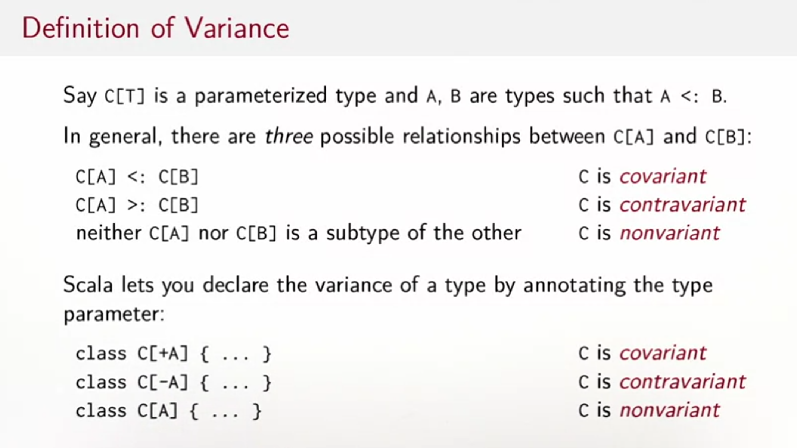

## Variance



```
trait Function1[-T, +U]
    def apply(x: T): U

---
function1 is contravariant in its argumant type T and covariant in its result type U  
```
- covariant type parameters can only appear in method results
- contravariant type parameters can only appear in method parameters
- invariant type parameters can appear anywhere.

+T/T/-T covariance/invariance/contravariance

Wrapper[Dog]

Wrapper[Domestic]

no relations means invariance (because of wrapper)

Вариантность — это сохранение совместимости присваивания исходных типов у производных типов.

Ковариантность (covariance) — это сохранение совместимости присваивания исходных типов у производных в прямом порядке.

Контравариантность (contravariance) — это сохранение совместимости присваивания исходных типов у производных в обратном порядке.

Инвариантность (invariance) — ситуация, когда наследование исходных типов не переносится на производные.

param is contravariant position (position consumes contravariant type)

```
S <: T means: S is a subtype of T, and
S >: T means: S is a supertype of T

C[A] <: C[B] C is covariant
C[A] >: C[B] C is contravariant
neither C[A] nor C[B] is a subtype of the other     C is nonvariant
```
