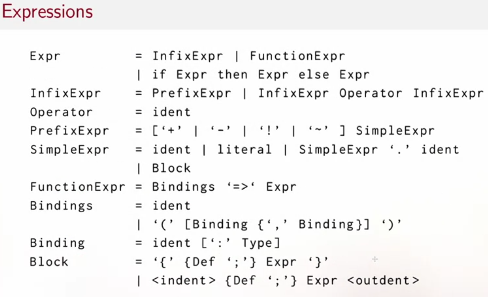
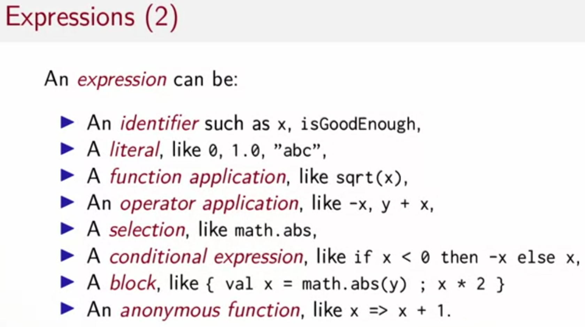
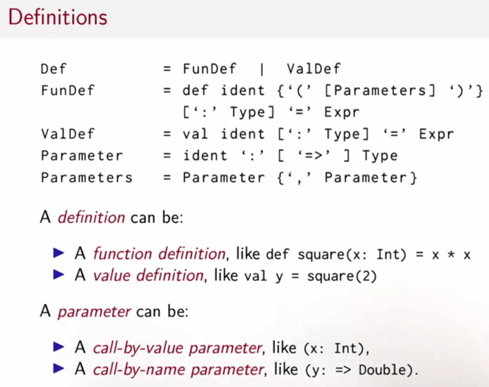
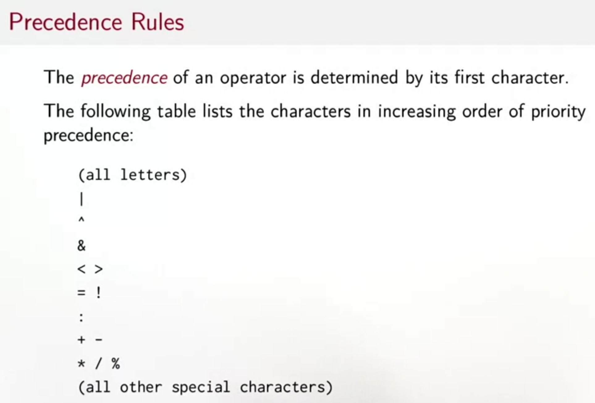

## [types](https://www.coursera.org/learn/scala-functional-programming/lecture/0AMxq/lecture-2-4-scala-syntax-summary)
- | denotes an alternative
- [...] an option (0 or 1)
- {...} a repetition (0 or more)
```
Type         = SimpleType | FunctionType
FunctionType = SimpleType '=>' Type
                | '(' [Types] ')' '=>' Type
SimpleType   = Ident
Types        = Type {',' Type }
```





